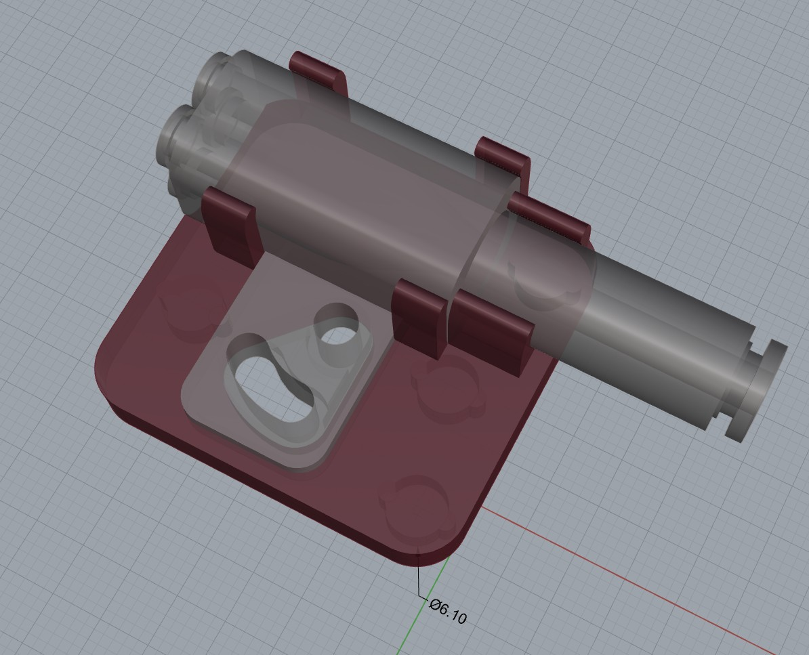

# Bambulab 4-in-1 Adapter Holder with Magnetic Mount

This project provides 3D models for a **Bambulab 4-in-1 Adapter Holder** designed for easy attachment to the backplate of the **Bambu P1S/X1 3D printers**. The holder uses magnets for quick attachment and detachment, offering flexibility to easily move and adjust the adapter.

## Features

- **Magnetic Mount**: The holder uses magnets to attach securely to the backplate of the Bambu P1S/X1 3D printers.
- **Easy to Move and Adjust**: The magnetic attachment allows for simple repositioning of the adapter holder without the need for additional tools.
- **Space-saving**: The holder ensures the 4-in-1 adapter stays close to the backplate, minimizing clutter and maximizing space on your 3D printer.

## Advantages

- **Flexible Adjustment**: The magnetic mount makes it easy to reposition the adapter holder, giving you full control over the placement and ensuring it fits your workspace perfectly.
- **Convenient Movement**: Unlike fixed mounts, this solution allows you to move the adapter holder quickly and easily, without the hassle of screws or complicated installations.
- **Close Fit to the Backplate**: The design ensures that the adapter holder stays as close as possible to the backplate, optimizing space while maintaining a secure fit.

## Folder Structure

This repository includes the following folder structure:

```bash
Copy code
assets/            # Folder for images (e.g., preview, magnet application)
stls/              # Folder for 3D model STL files
3mf/               # Folder for 3MF files
readme.md          # This README file
readme.zh.md       # readme in Chinese
.gitignore         # Git ignore file
```

## 3D Models

- The project includes 3D models for printing the adapter holder with a magnetic mount.
- You can find the **STL** and **3MF** files in the `stls/` and `3mf/` directories respectively.
- The holder is designed for easy integration with **Bambulab 4-in-1 Adapter**.

## Images

### Preview of the Adapter Holder


Here is a preview of the **Bambulab 4-in-1 Adapter Holder** that you can print and use with your Bambu P1S/X1 3D printer.

### Magnet Application


This image demonstrates how to install the magnets to ensure the adapter holder is securely attached to the backplate of the Bambu P1S/X1 printer.

## Assembly Instructions

1. **Print the Holder**: Download the 3D model files from the repository and print them using your 3D printer.
2. **Attach the Magnets**: Insert the magnets (D=6mm, H=3mm) into the designated holes on the holder.
3. **Mount on the Backplate**: Attach the magnetic holder to the backplate of your Bambu P1S/X1 printer. The magnets will hold the adapter securely in place.
4. **Adjust and Move**: You can now easily move and adjust the position of the adapter holder on the backplate for optimal space management.

## License

This project is licensed under the [Creative Commons Attribution 4.0 International License](https://creativecommons.org/licenses/by/4.0/).
