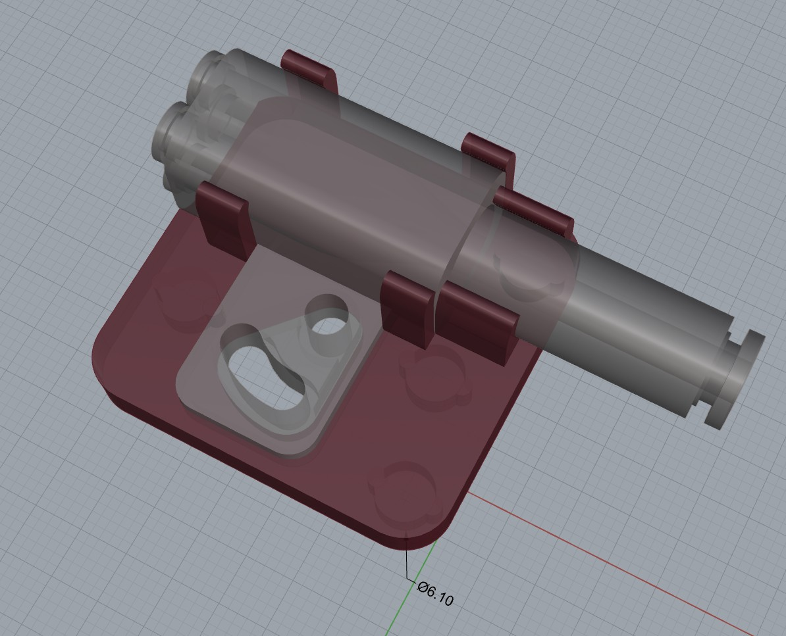

为拓竹p系五通提供磁吸固定座

Provide a magnetic holder for 4-in-1 PTFE Adapter

孔洞规格为D=6.1mm，H=3.4mm， 使用D=6mm，H=3mm的圆形磁铁

The hole size is D=6.1mm, H=3.4mm, you sohuld push magnet(with specification D=6mm,h=3mm) in the holes

